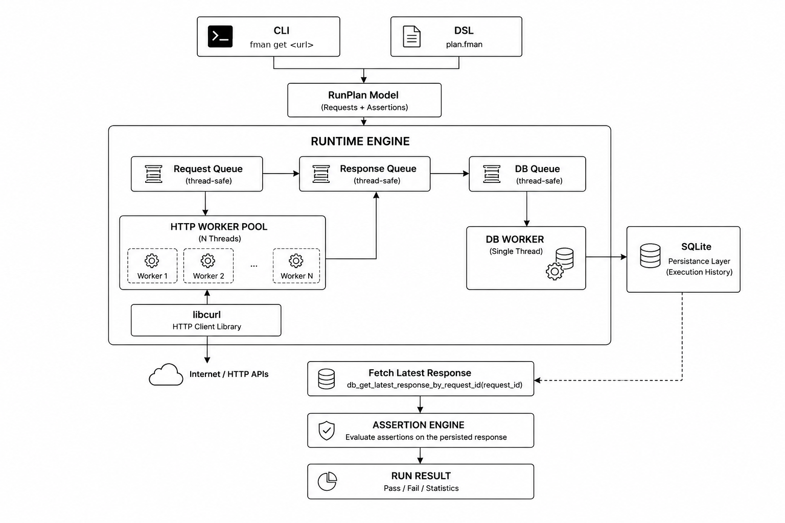

<div align="center">

# FMAN

**Parallel HTTP API test runner written in ISO C99**

[](https://opensource.org/licenses/MIT)
[]()
[]()


</div>

## Overview

FMAN is a command-line tool for running HTTP API checks from CLI arguments or `.fman` files.

Single request from the command line:

```bash
fman get https://example.com --expect-status 200
```

Multiple checks can be written in a plain text `.fman` file:

```http
GET https://example.com
EXPECT status 200
EXPECT header Content-Type text/html
EXPECT body contains "Example Domain"

GET https://httpbin.org/json
EXPECT status 200
EXPECT header Content-Type application/json
```

Run the file with:

```bash
fman run smoke.fman
```

Each parsed request is added to a `RunPlan`. When the plan contains multiple requests, FMAN schedules them across worker threads and executes them in parallel.

Both CLI and DSL input paths produce the same internal `RunPlan`. CLI usage commonly creates a single-request plan, while `.fman` files are intended for multi-request runs.

FMAN is implemented in ISO C99 and uses `libcurl`, `SQLite`, POSIX threads, and CMake.

## Architecture

FMAN uses the same runtime path for CLI commands and `.fman` files. Input parsing is separate from execution; both inputs are converted into a `RunPlan` before scheduling.

A `RunPlan` may contain one or more requests. The runtime does not execute the plan sequentially by default; requests are dispatched through a worker queue and processed by the HTTP worker pool.

<table>
  <tr>
    <td width="68%" valign="top">
      
    </td>
    <td width="32%" valign="top">

<strong>Runtime components</strong>

<table>
  <tr>
    <th align="left">Component</th>
    <th align="left">Role</th>
  </tr>
  <tr>
    <td><code>RunPlan</code></td>
    <td>request and assertion model</td>
  </tr>
  <tr>
    <td><code>Request Queue</code></td>
    <td>thread-safe request dispatch</td>
  </tr>
  <tr>
    <td><code>HTTP Worker Pool</code></td>
    <td>parallel request execution</td>
  </tr>
  <tr>
    <td><code>Response Queue</code></td>
    <td>completed response collection</td>
  </tr>
  <tr>
    <td><code>DB Worker</code></td>
    <td>serialized SQLite writes</td>
  </tr>
  <tr>
    <td><code>Assertion Engine</code></td>
    <td>status, header, and body checks</td>
  </tr>
</table>

</td>
  </tr>
</table>

Execution flow:

```text
CLI / DSL -> RunPlan -> Request Queue -> Worker Pool -> Response Queue -> SQLite -> Assertions -> RunResult
```

## Installation

### Requirements

| Dependency    | Purpose             |
| ------------- | ------------------- |
| CMake         | Build configuration |
| GCC / Clang   | C compiler          |
| libcurl       | HTTP client backend |
| SQLite3       | Local persistence   |
| POSIX threads | Worker execution    |

### Build

```bash
git clone https://github.com/Honuratus/FMAN.git
cd FMAN

./scripts/install.sh

cmake -S . -B build
cmake --build build
```

Optional system install:

```bash
sudo cmake --install build
```

## Usage

### CLI

Basic request:

```bash
fman get https://example.com
```

Status, header, and body assertions:

```bash
fman get https://example.com \
  --expect-status 200 \
  --expect-header "Content-Type" "text/html" \
  --expect-body "Example Domain"
```

Binary body assertion:

```bash
fman get http://127.0.0.1:8080/test.bin \
  --expect-status 200 \
  --expect-body hex:7F8A
```

### DSL

Example `smoke.fman` file:

```http
GET https://example.com
EXPECT status 200
EXPECT header Content-Type text/html
EXPECT body contains "Example Domain"

GET https://httpbin.org/json
EXPECT status 200
EXPECT header Content-Type application/json
```

Run a DSL file:

```bash
fman run smoke.fman
```

Requests parsed from a `.fman` file are added to the same `RunPlan` and are executed by the parallel runtime.

The DSL is parsed with a handwritten lexer and recursive-descent parser. Parsed DSL input is converted into the same `RunPlan` representation used by the CLI.

## Performance

Benchmark setup:

| Parameter          | Value             |
| ------------------ | ----------------- |
| Requests           | 128               |
| Artificial latency | 200 ms            |
| Server             | Local HTTP server |

### Runtime scaling

<table>
  <tr>
    <td width="620">
      
    </td>
    <td valign="top">
      <table>
        <tr>
          <th align="right">Workers</th>
          <th align="right">Time</th>
        </tr>
        <tr><td align="right">1</td><td align="right">25.751 s</td></tr>
        <tr><td align="right">2</td><td align="right">12.922 s</td></tr>
        <tr><td align="right">4</td><td align="right">6.511 s</td></tr>
        <tr><td align="right">8</td><td align="right">3.254 s</td></tr>
        <tr><td align="right">16</td><td align="right">1.692 s</td></tr>
        <tr><td align="right">32</td><td align="right">1.492 s</td></tr>
        <tr><td align="right"><strong>64</strong></td><td align="right"><strong>1.331 s</strong></td></tr>
        <tr><td align="right">128</td><td align="right">1.619 s</td></tr>
      </table>
    </td>
  </tr>
</table>

### Throughput

<table>
  <tr>
    <td width="620">
      
    </td>
    <td valign="top">
      <table>
        <tr>
          <th align="right">Workers</th>
          <th align="right">Throughput</th>
        </tr>
        <tr>
          <td align="right"><strong>64</strong></td>
          <td align="right"><strong>~96 req/s</strong></td>
        </tr>
      </table>
    </td>
  </tr>
</table>

### Memory usage

<table>
  <tr>
    <td width="620">
      
    </td>
    <td valign="top">
      <table>
        <tr>
          <th align="right">Workers</th>
          <th align="right">Memory</th>
        </tr>
        <tr>
          <td align="right">128</td>
          <td align="right">&lt;18 MB</td>
        </tr>
      </table>
    </td>
  </tr>
</table>

## Memory Checking

Valgrind summary:

```text
in use at exit: 0 bytes in 0 blocks
4,755 allocs, 4,755 frees
ERROR SUMMARY: 0 errors from 0 contexts
```

## Development

Run the full local check script:

```bash
./scripts/check.sh
```

The script runs:

* configure
* build
* unit tests
* integration tests
* smoke tests
* Valgrind

## Feature Status

| Area               | Status      |
| ------------------ | ----------- |
| Parallel runtime   | Implemented |
| Worker pool        | Implemented |
| SQLite persistence | Implemented |
| CLI interface      | Implemented |
| DSL parser         | Implemented |
| Assertion engine   | Implemented |
| POST / PUT / PATCH | Planned     |
| Variables          | Planned     |
| Environment files  | Planned     |
| JSON assertions    | Planned     |
| Authentication     | Planned     |
| Collections        | Planned     |
| HTML reports       | Planned     |
| JUnit export       | Planned     |

## Contributing

Pull requests should:

* follow the existing code style
* keep changes focused
* include tests for new behavior
* pass `scripts/check.sh`

## License

MIT License.

FMAN uses libcurl, SQLite, POSIX threads, and CMake.